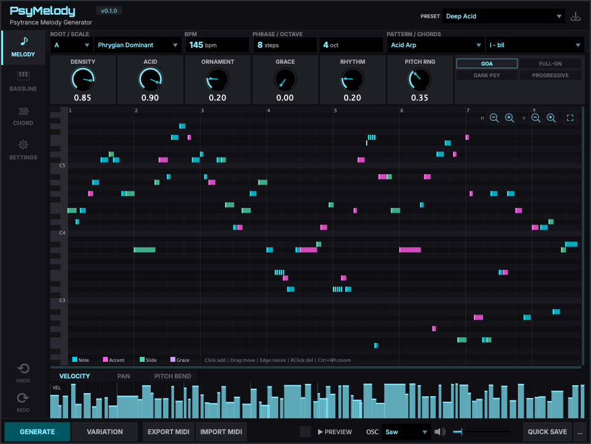

# PsyMelody

**Psytrance MIDI Generator Plugin (VST3 / AU) by EDEN**

PsyMelody is a MIDI generator plugin for Psytrance music production. It generates melodies, basslines, and chord voicings based on scales, chord progressions, and rhythm patterns characteristic of Psytrance subgenres.



## Download

**[Download PsyMelody v0.1.0](https://github.com/efirio-git/PsyMelody/releases/tag/v0.1.0)**

## Features

- **Melody / Bassline / Chord Voicing** generation
- **Subgenres**: Goa, Full-On, Dark Psy, Progressive Psy
- **Built-in piano roll** editor with undo/redo
- **Preview synth** (Saw / Square / Sine / Triangle)
- **MIDI export / import**
- **Preset system** with save/load
- **DAW BPM sync**

## System Requirements

- macOS 10.15 (Catalina) or later
- Apple Silicon or Intel (Universal Binary)
- VST3 or AU compatible DAW

## Installation

1. Open `PsyMelody_v0.1.0.dmg`
2. Run `PsyMelody_Installer.pkg`
3. Click **Customize** to select VST3 and/or AU
4. Restart your DAW and rescan plugins

See [Installation Guide](docs/Installation_Guide.md) for DAW-specific setup instructions.

## Building from Source

### Requirements
- CMake 3.22+
- C++17 compiler
- [JUCE Framework](https://juce.com/)

### Build
```bash
cmake -B build
cmake --build build --config Release
```

Build outputs are in `build/PsyMelody_artefacts/Release/`.

## License

This project is licensed under the [GNU Affero General Public License v3.0](LICENSE).

PsyMelody is built with the [JUCE Framework](https://juce.com/) under the AGPLv3.

## Author

Developed by **EDEN**
